# DocuSense

> An AI-powered document repository for HR teams. HR uploads files, shares them with employees or groups, and employees can read and ask an AI assistant questions — answered strictly from the document itself.

---

## System Architecture

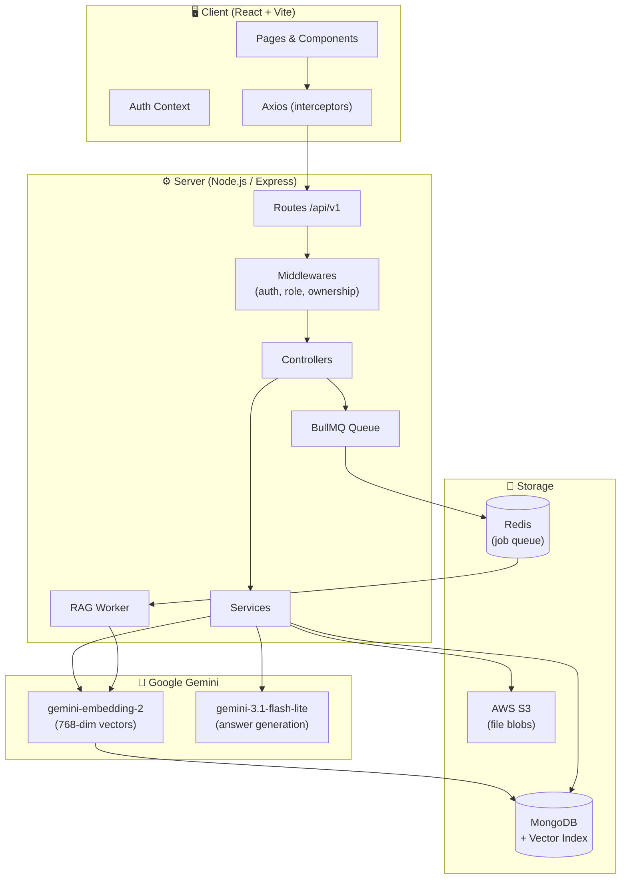

---

## Technology Stack

| Layer | Tech |
|---|---|
| Frontend | React 19 (Vite), React Router v7, Axios |
| UI | Glassmorphism, react-pdf, mammoth (DOCX), react-markdown, framer-motion |
| Backend | Node.js, Express |
| Database | MongoDB (`mongodb-atlas-local` — includes Vector Search) |
| AI | Google Gemini — `gemini-embedding-2` embeddings, `gemini-3.1-flash-lite` generation |
| Queue | BullMQ + Redis (background RAG processing) |
| File Storage | AWS S3 (MinIO locally — same API) |
| Auth | JWT (15 min access token + httpOnly refresh cookie) + Google OAuth 2.0 |
| Validation | Zod — env vars and all request bodies |
| Logging | Winston |
| Infra | Docker Compose + Terraform (EC2, S3, IAM, Elastic IP) |

---

## Role Permissions

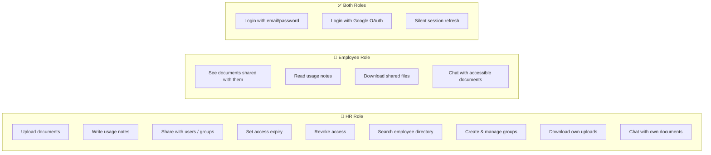

> **All permissions are enforced server-side on every request. The client cannot bypass them.**

---

## Authentication Flow

### Local Auth (Email + Password)

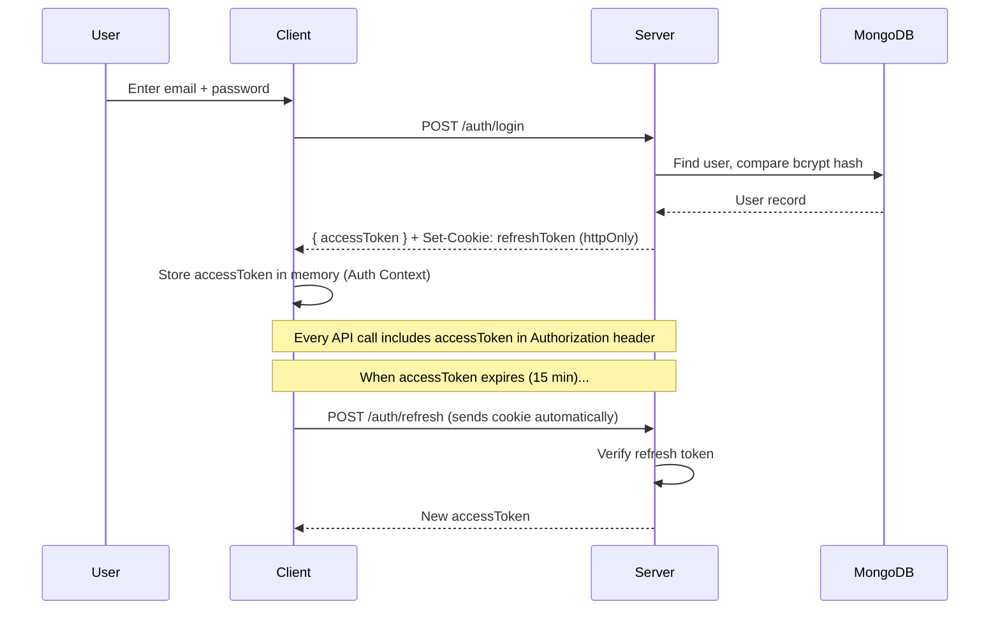

### Google OAuth Flow

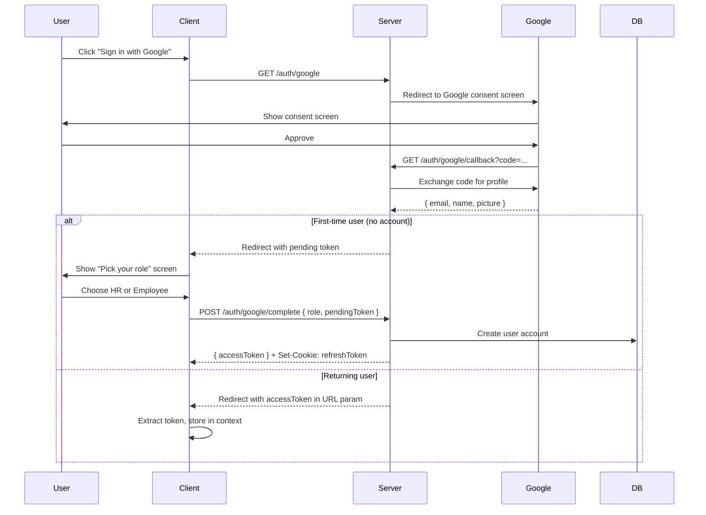

---

## RAG Pipeline

### Upload & Indexing (Background Job)

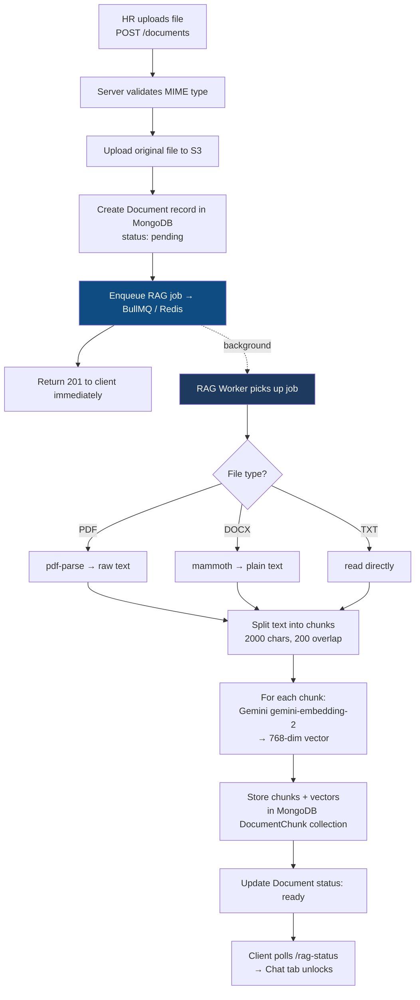

### Chat / Question Answering

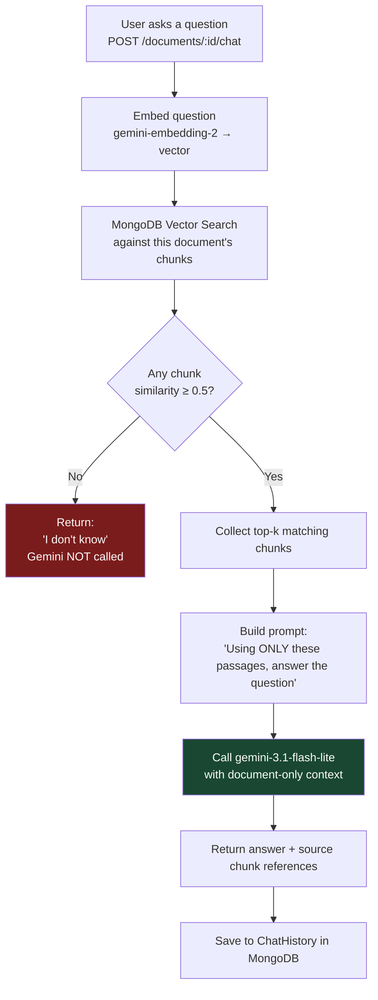

---

## Document Access Control

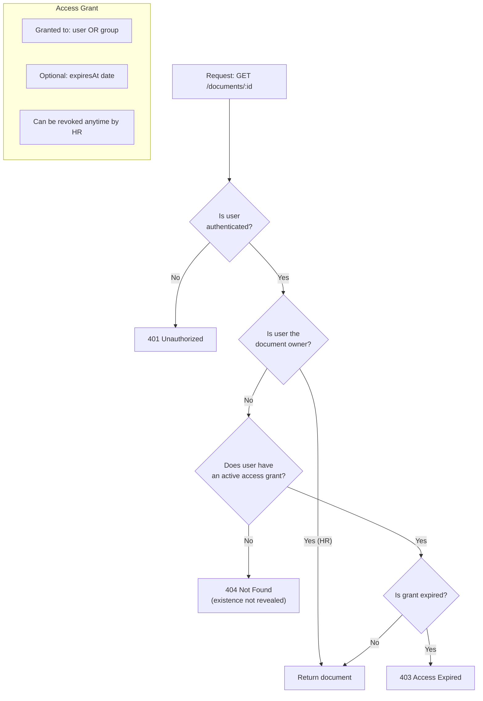

---

## Document Viewer

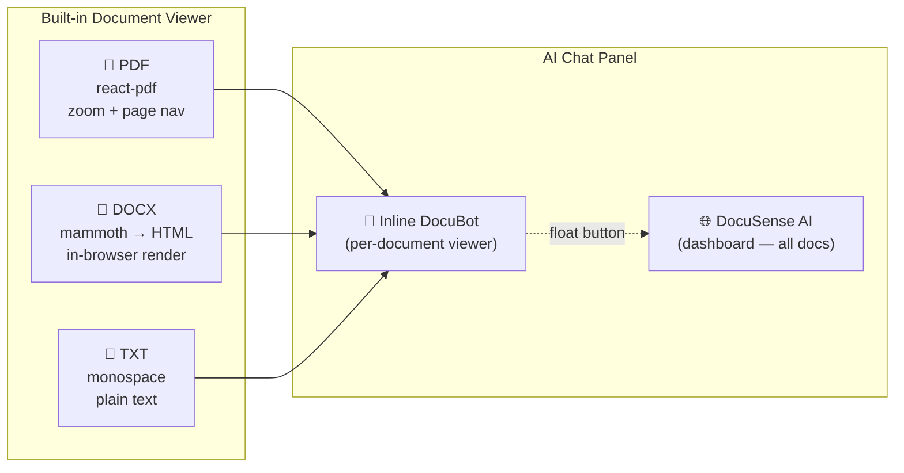

---

## API Reference

### Auth — `/api/v1/auth`

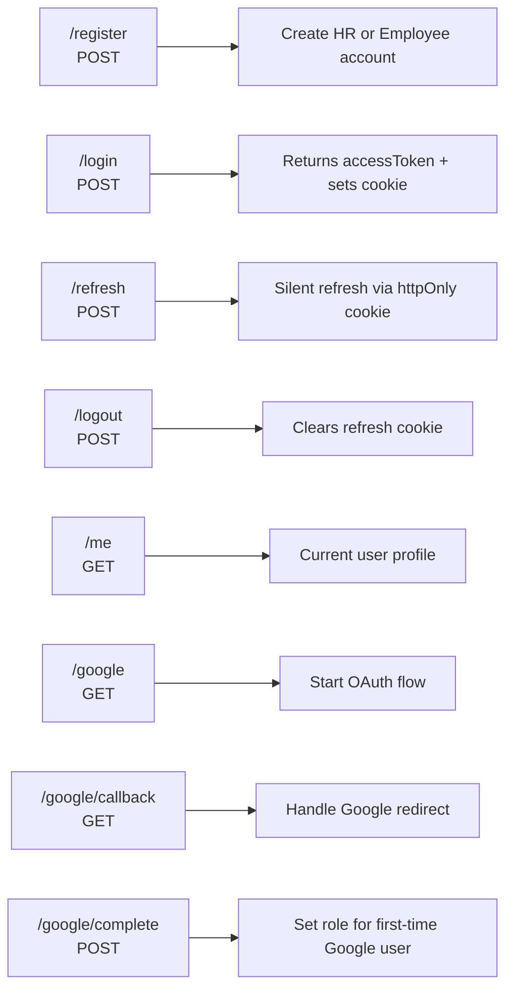

### Documents — `/api/v1/documents`

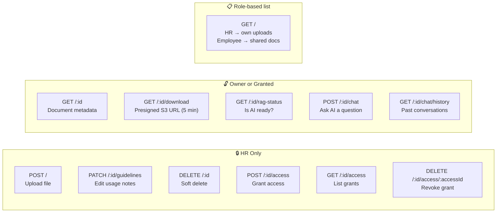

### HR — `/api/v1/hr`

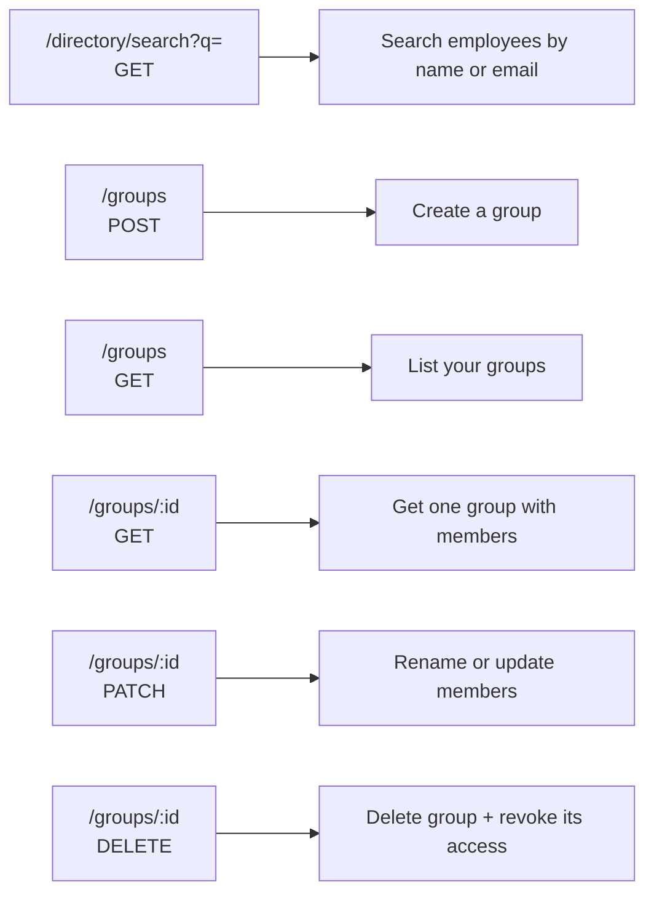

---

## AWS Infrastructure (Terraform)

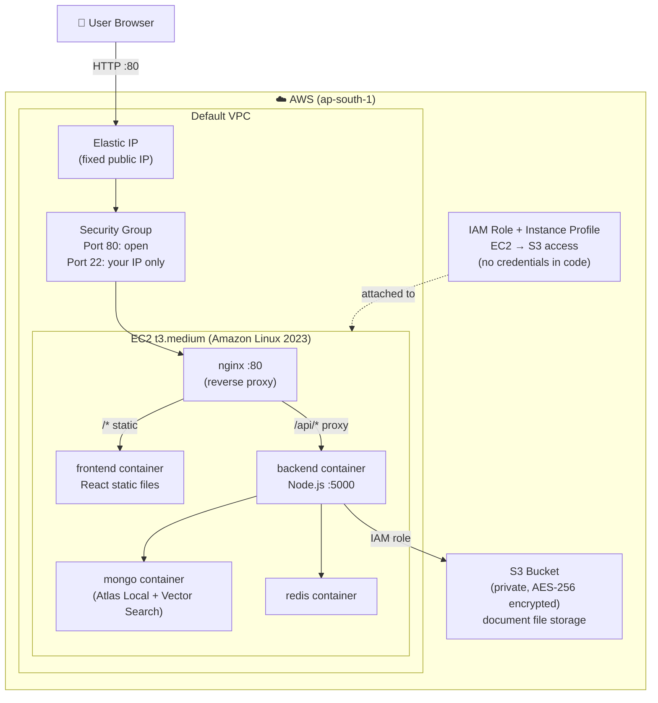

### What Terraform Creates

| Resource | Purpose |
|---|---|
| EC2 t3.medium | Runs all 4 Docker containers |
| Elastic IP | Fixed public IP that survives restarts |
| S3 bucket (private) | Document file storage, AES-256 encrypted |
| IAM role + instance profile | Lets EC2 access S3 — no credentials in code |
| Security group | Port 80 open, SSH locked to your IP only |

---

## Deployment Flow

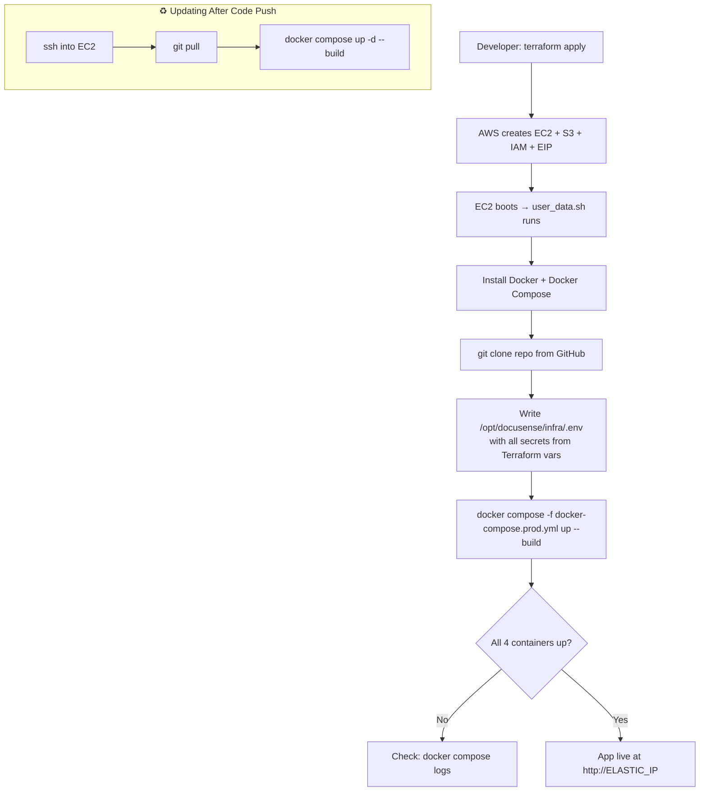

---

## Running Locally

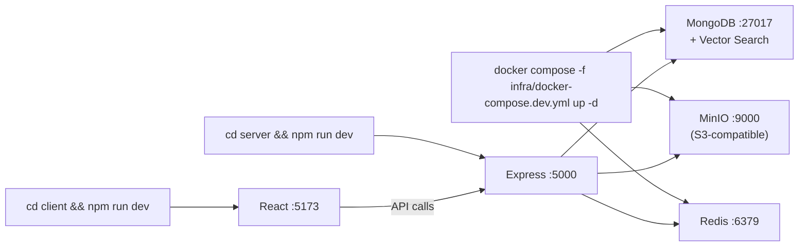

**Required `server/.env` variables:**

| Variable | Description |
|---|---|
| `MONGO_URI` | MongoDB connection string |
| `JWT_ACCESS_SECRET` | Secret for access tokens (min 32 chars) |
| `JWT_REFRESH_SECRET` | Secret for refresh tokens (different from above) |
| `PENDING_ROLE_TOKEN_SECRET` | Secret for Google OAuth pending-role tokens |
| `CLIENT_ORIGIN` | Frontend URL for CORS (`http://localhost:5173`) |
| `S3_ENDPOINT` | MinIO URL locally (`http://localhost:9000`) |
| `S3_REGION` | S3 region |
| `S3_BUCKET` | Bucket name |
| `S3_ACCESS_KEY_ID` | S3 / MinIO access key |
| `S3_SECRET_ACCESS_KEY` | S3 / MinIO secret key |
| `GEMINI_API_KEY` | Google Gemini API key |
| `REDIS_URL` | Redis URL (`redis://localhost:6379`) |
| `GOOGLE_CLIENT_ID` | Google OAuth client ID |
| `GOOGLE_CLIENT_SECRET` | Google OAuth client secret |
| `GOOGLE_REDIRECT_URI` | OAuth callback URL |

---

## Security Model

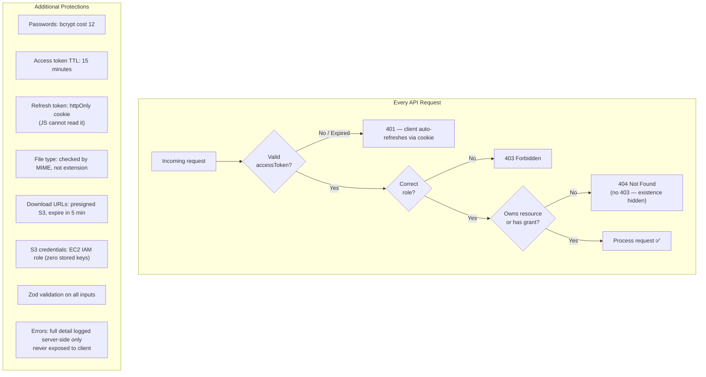

---

## Server Folder Structure

```
server/src/
├── app.js               # Express app setup, middleware, routes
├── server.js            # HTTP server + graceful shutdown
├── config/              # env validation (Zod), DB connect, S3 client
├── controllers/         # auth, documents, hr
├── middlewares/         # authenticate, requireRole, requireOwnership
├── models/              # User, Document, DocumentChunk, AccessGrant,
│                        # Group, ChatHistory
├── queues/              # BullMQ queue definition
├── routes/              # /auth, /documents, /hr
├── services/            # auth, document, hr, rag (embed + search + generate)
├── utils/               # logger (Winston), errors, asyncHandler
├── validators/          # Zod schemas for request bodies
└── workers/             # rag.worker.js — background embedding job
```

## Client Folder Structure

```
client/src/
├── App.jsx              # Router + protected route wrappers
├── context/             # AuthContext (token storage + refresh)
├── hooks/               # useAuth, useDocuments, usePolling
├── layouts/             # AppLayout (sidebar + header)
├── pages/               # Login, Dashboard, DocumentView, Admin
├── components/          # ChatBot, DocumentViewer, GroupManager, …
├── services/            # Axios instance + API call functions
└── utils/               # token helpers, date formatting
```
