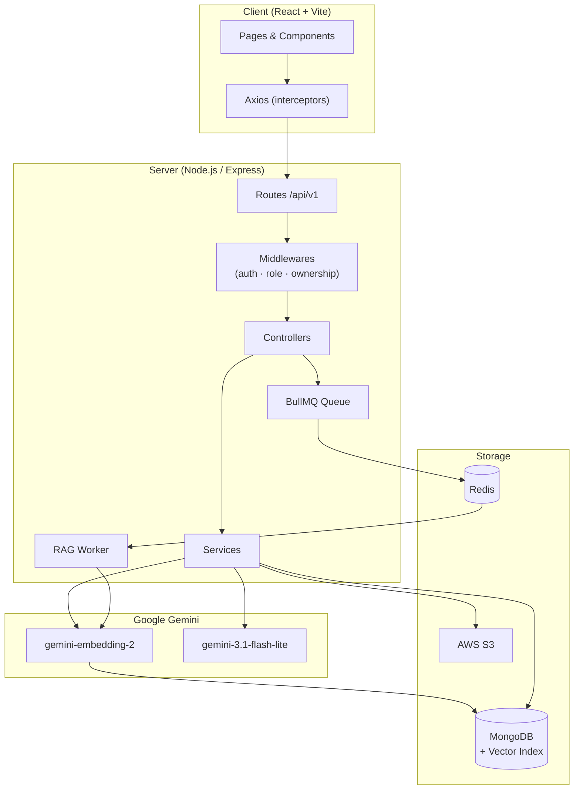
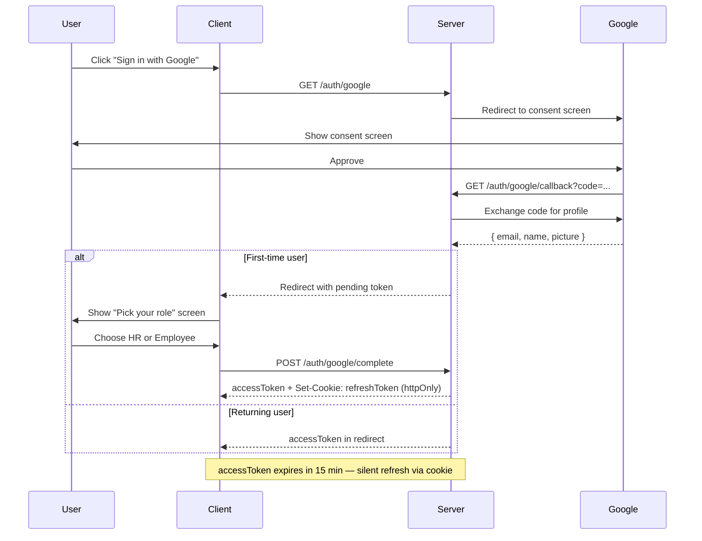
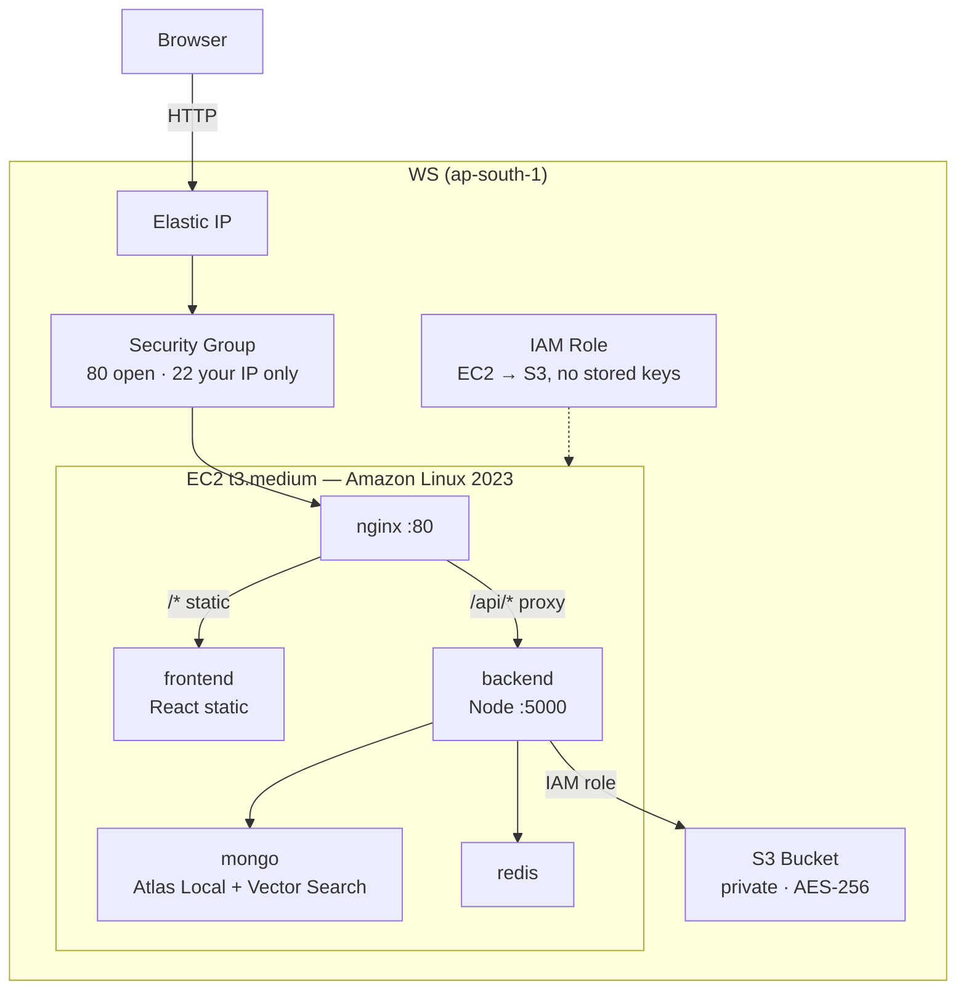

# DocuSense

> An AI-powered document repository for HR teams. HR uploads files, shares them with employees or groups, and employees can read and ask an AI assistant questions — answered strictly from the document itself.

---

## System Architecture



---

## Stack

| Layer | Tech |
|---|---|
| Frontend | React 19 (Vite), React Router v7, Axios |
| UI | Glassmorphism, react-pdf, mammoth (DOCX), react-markdown, framer-motion |
| Backend | Node.js, Express |
| Database | MongoDB (`mongodb-atlas-local` — includes Vector Search) |
| AI | Google Gemini — `gemini-embedding-2` embeddings, `gemini-3.1-flash-lite` generation |
| Queue | BullMQ + Redis (background RAG processing) |
| File Storage | AWS S3 (MinIO locally — same API) |
| Auth | JWT (15 min access token + httpOnly refresh cookie) + Google OAuth 2.0 |
| Validation | Zod — env vars and all request bodies |
| Infra | Docker Compose + Terraform (EC2, S3, IAM, Elastic IP) |

---

## Roles

| Action | HR | Employee |
|---|---|---|
| Upload documents | ✓ | |
| Write usage notes | ✓ | |
| Share / revoke access, set expiry | ✓ | |
| Search employee directory | ✓ | |
| Create and manage groups | ✓ | |
| See documents shared with them | | ✓ |
| Read usage notes | ✓ | ✓ |
| Download files | own uploads | if access is active |
| Ask the AI assistant | own uploads | anything they can access |

All permissions are enforced server-side on every request.

---

## Authentication

### Google OAuth Flow



Local auth (email + bcrypt password) follows the same token pattern without the OAuth steps.

---

## RAG Pipeline

```mermaid
flowchart LR
    subgraph Upload["On Upload (background)"]
        direction TB
        A["HR uploads file"] --> B["S3 store + MongoDB record\nstatus: pending"]
        B --> C["Enqueue job → BullMQ"]
        C -.->|async| D["Worker: extract text\nPDF · DOCX · TXT"]
        D --> E["Split into chunks\n2000 chars / 200 overlap"]
        E --> F["Embed each chunk\ngemini-embedding-2 → 768-dim vector"]
        F --> G["Store in MongoDB\nstatus: ready"]
    end

    subgraph Chat["On Question"]
        direction TB
        H["User asks question"] --> I["Embed question → vector"]
        I --> J["MongoDB Vector Search\nagainst document chunks"]
        J --> K{"similarity ≥ 0.5?"}
        K -->|No| L["Return: I don't know\nGemini not called"]
        K -->|Yes| M["Build prompt with\nmatching passages only"]
        M --> N["gemini-3.1-flash-lite\n→ answer + source refs"]
    end

    G -.->|"Chat tab unlocks"| H

    style L fill:#7b1c1c,color:#fff
    style N fill:#1a4731,color:#fff
```



---

## API

Base: `/api/v1` — all responses: `{ success, data }` or `{ success: false, error }`.

**Auth** `/auth`

| Method | Path | Description |
|---|---|---|
| POST | `/register` | Register as HR or Employee |
| POST | `/login` | Returns access token, sets refresh cookie |
| POST | `/refresh` | Silent token refresh via cookie |
| POST | `/logout` | Clears refresh cookie |
| GET | `/me` | Current user profile |
| GET | `/google` | Start Google OAuth flow |
| GET | `/google/callback` | Google OAuth redirect handler |
| POST | `/google/complete` | Set role for first-time Google user |

**Documents** `/documents`

| Method | Path | Who | Description |
|---|---|---|---|
| POST | `/` | HR | Upload a file (triggers background RAG) |
| GET | `/` | Both | HR → own uploads · Employee → shared docs |
| GET | `/:id` | Owner or granted | Document metadata + usage notes |
| GET | `/:id/download` | Owner or granted | Presigned S3 URL (5 min) |
| PATCH | `/:id/guidelines` | HR owner | Edit usage notes |
| DELETE | `/:id` | HR owner | Soft delete, revokes all access |
| POST | `/:id/access` | HR owner | Grant access to user or group |
| GET | `/:id/access` | HR owner | List active grants |
| DELETE | `/:id/access/:accessId` | HR owner | Revoke one grant |
| GET | `/:id/rag-status` | Owner or granted | Is AI processing complete? |
| POST | `/:id/chat` | Owner or granted | Ask the AI a question |
| GET | `/:id/chat/history` | Owner or granted | Past Q&A |

**HR** `/hr`

| Method | Path | Description |
|---|---|---|
| GET | `/directory/search?q=` | Search employees by name or email |
| POST | `/groups` | Create a group |
| GET | `/groups` | List your groups |
| GET | `/groups/:id` | Get one group with members |
| PATCH | `/groups/:id` | Rename or update members |
| DELETE | `/groups/:id` | Delete group and revoke its access |

---

## AWS Infrastructure



| Resource | Purpose |
|---|---|
| EC2 t3.medium | Runs all 4 Docker containers |
| Elastic IP | Fixed public IP that survives restarts |
| S3 bucket | Document file storage, private + encrypted |
| IAM role | EC2 → S3 access with no credentials in code |
| Security group | Port 80 open, SSH locked to your IP only |

---

## Running Locally

```bash
# 1. Start dependencies (MongoDB + MinIO + Redis)
docker compose -f infra/docker-compose.dev.yml up -d

# 2. Start backend
cd server && npm install && npm run dev    # → http://localhost:5000

# 3. Start frontend
cd client && npm install && npm run dev    # → http://localhost:5173
```

**Required `server/.env`:**

| Variable | Description |
|---|---|
| `MONGO_URI` | MongoDB connection string |
| `JWT_ACCESS_SECRET` | Secret for access tokens |
| `JWT_REFRESH_SECRET` | Secret for refresh tokens |
| `PENDING_ROLE_TOKEN_SECRET` | Secret for Google OAuth pending-role tokens |
| `CLIENT_ORIGIN` | Frontend URL for CORS (`http://localhost:5173`) |
| `S3_ENDPOINT` | MinIO URL locally (`http://localhost:9000`) |
| `S3_REGION` | S3 region |
| `S3_BUCKET` | Bucket name |
| `S3_ACCESS_KEY_ID` | S3 / MinIO access key |
| `S3_SECRET_ACCESS_KEY` | S3 / MinIO secret key |
| `GEMINI_API_KEY` | Google Gemini API key |
| `REDIS_URL` | Redis URL (`redis://localhost:6379`) |
| `GOOGLE_CLIENT_ID` | Google OAuth client ID |
| `GOOGLE_CLIENT_SECRET` | Google OAuth client secret |
| `GOOGLE_REDIRECT_URI` | OAuth callback URL |

---

## Deploying to AWS

```bash
# One-time setup
aws configure                                   # paste IAM access key + secret
ssh-keygen -t ed25519 -f ~/.ssh/docusense_key  # keypair for SSH access
```

Create `infra/terraform/terraform.tfvars` (gitignored):
```hcl
aws_region                = "ap-south-1"
my_ip_cidr                = "YOUR_IP/32"
ssh_public_key            = "ssh-ed25519 AAAA..."   # cat ~/.ssh/docusense_key.pub
repo_url                  = "https://github.com/venunisandhan/DocuSense.git"
s3_bucket_name            = "docusense-documents-yourname-2024"
mongo_password            = "StrongPassword123!"
jwt_access_secret         = "..."                    # openssl rand -hex 32
jwt_refresh_secret        = "..."
pending_role_token_secret = "..."
gemini_api_key            = "YOUR_GEMINI_KEY"
google_client_id          = "....apps.googleusercontent.com"
google_client_secret      = "GOCSPX-..."
```

```bash
cd infra/terraform
terraform init && terraform plan && terraform apply
# Outputs the Elastic IP — add it to Google OAuth Authorized redirect URIs
# Wait ~10 min for EC2 to boot and start containers
# App live at http://<ELASTIC_IP>
```

**Managing the server:**
```bash
ssh -i ~/.ssh/docusense_key ec2-user@<EC2_IP>
cd /opt/docusense/infra

# View logs
docker compose -f docker-compose.prod.yml logs -f

# Redeploy after a code push
cd /opt/docusense && git pull
cd infra && docker compose -f docker-compose.prod.yml up -d --build

# Tear down
cd ~/Documents/DocuSense/infra/terraform && terraform destroy
```

---

## Security

- Passwords hashed with bcrypt (cost 12)
- Access tokens expire in 15 min; silent refresh via httpOnly cookie (JS cannot read it)
- Every request: authenticated → correct role → owns or has been granted access
- Unauthorized requests get 404, not 403 — resource existence is never revealed
- File type validated by MIME type, not extension
- Download URLs are presigned S3 links that expire in 5 minutes
- No AWS credentials in code — EC2 IAM role provides them
- Zod validation on all inputs; full errors logged server-side only

---

## Project Structure

```
server/src/
├── config/        # env validation (Zod), DB, S3 client
├── controllers/   # auth, documents, hr
├── middlewares/   # authenticate, requireRole, requireOwnership
├── models/        # User, Document, DocumentChunk, AccessGrant, Group, ChatHistory
├── queues/        # BullMQ queue definition
├── routes/        # /auth, /documents, /hr
├── services/      # auth, document, hr, rag (embed + search + generate)
├── utils/         # logger (Winston), errors, asyncHandler
├── validators/    # Zod schemas
└── workers/       # rag.worker.js — background embedding job

client/src/
├── context/       # AuthContext (token + refresh)
├── hooks/         # useAuth, useDocuments, usePolling
├── layouts/       # AppLayout (sidebar + header)
├── pages/         # Login, Dashboard, DocumentView, Admin
├── components/    # ChatBot, DocumentViewer, GroupManager, …
└── services/      # Axios instance + API call functions
```
