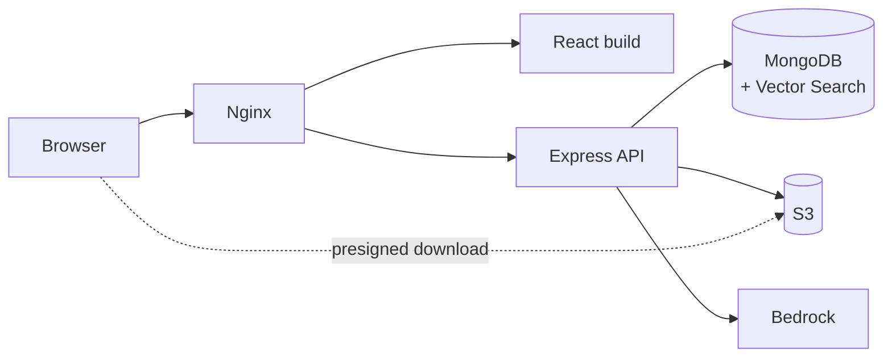
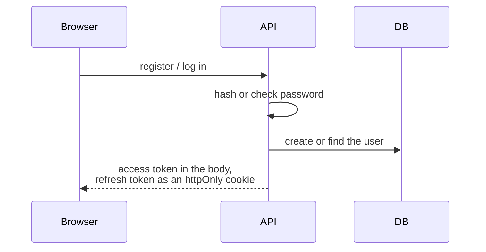
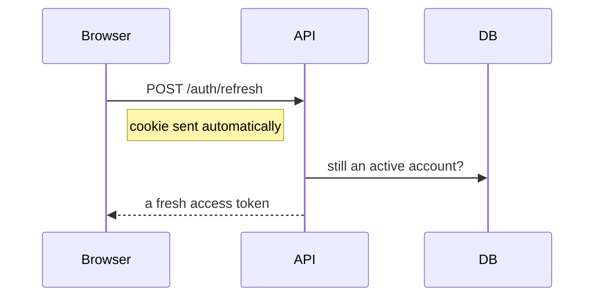
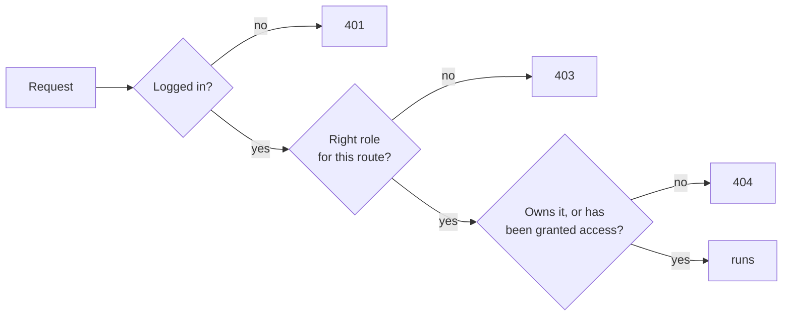
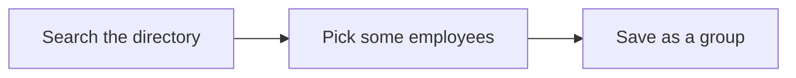
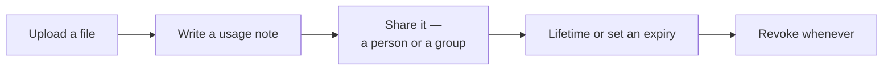
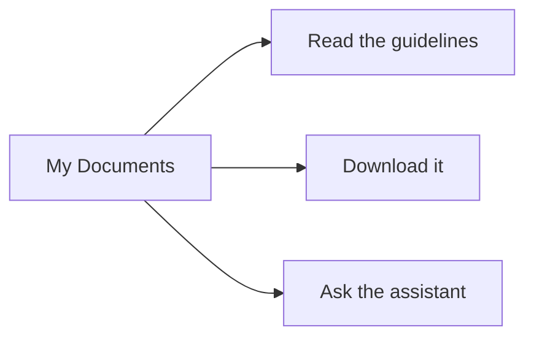
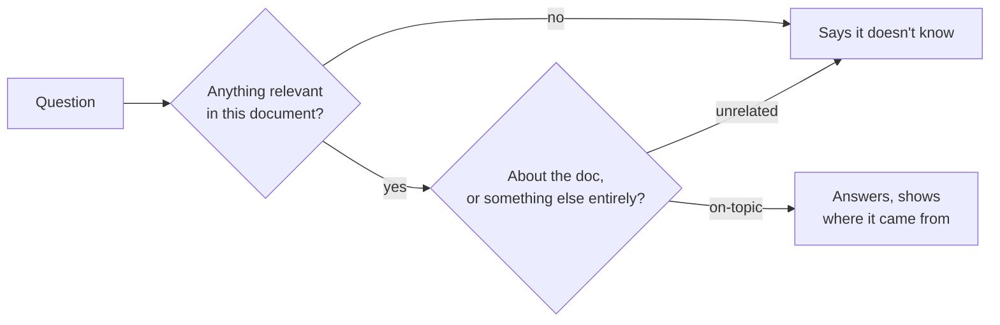
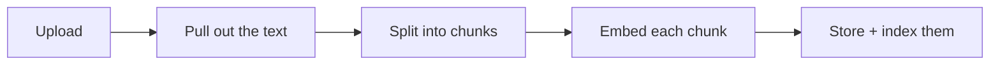
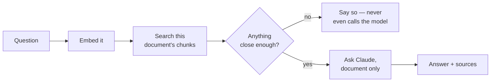

# DocuSense — AI-Powered Document Repository & RAG Assistant

A document repository where HR shares files with employees — one person or a whole group, forever or until a set date — and employees can ask an AI assistant questions about those files, grounded in what the file actually says.

---

## Contents

1. [What it does](#what-it-does)
2. [Stack](#stack)
3. [Architecture](#architecture)
4. [Roles](#roles)
5. [Auth](#auth)
6. [HR flow](#hr-flow)
7. [Employee flow](#employee-flow)
8. [The RAG assistant](#the-rag-assistant)
9. [Data models](#data-models)
10. [API](#api)
11. [Project layout](#project-layout)
12. [Running it locally](#running-it-locally)
13. [Deployment](#deployment)
14. [Security](#security)

---

## What it does

Two roles: **HR** and **Employee**. Both sign up themselves, picking a role at signup (or via Google).

HR uploads files (PDF, DOCX, TXT), writes a short usage note for each one, and shares them — with one employee or a whole group, either permanently or until a chosen date. Access can be pulled back at any time.

Employees only ever see what's been shared with them. They can read the usage notes, download the file, and ask the assistant things like "summarize this" or "what should I be careful about here" — answered strictly from the document itself. Ask it something unrelated, like a trivia question, and it says so instead of guessing.

Everything runs in three containers — Mongo, the API, and Nginx — behind a single EC2 box that Terraform builds. Files live in S3, the AI runs on Bedrock.

---

## Stack

| Layer | Tech | Why |
|---|---|---|
| Frontend | React (Vite), React Router, Axios | fast dev loop, simple routing for two very different dashboards |
| Backend | Node, Express | small, well-understood, easy to reason about |
| Database | MongoDB — `mongodb-atlas-local` image | this one image gives real Vector Search without needing a cloud Atlas account |
| File storage | S3 (MinIO locally, same API) | keeps big binary files out of the database, where they don't belong |
| AI | Bedrock — Titan Embeddings + Claude Haiku | pay-per-use, no servers to manage, reached through an IAM role instead of stored keys |
| Auth | JWT + bcrypt + Google OAuth | short-lived tokens, cookie-based refresh, no session store needed |
| Validation | Zod | one library, used everywhere — env vars and request bodies alike |
| Logs | Winston | structured JSON instead of scattered console.log calls |
| Containers | Docker Compose | the same compose file runs locally and in prod |
| Infra | Terraform | the whole AWS side comes up from one `apply` |

---

## Architecture



One box, three containers. Nginx hands off static files or forwards to the API. The API is the only thing that talks to Mongo — it's never reachable from outside the box. Downloads don't pass through the API at all; the browser gets a signed link and pulls the file straight from S3.

---

## Roles

| Can... | HR | Employee |
|---|---|---|
| Sign up / log in | ✓ | ✓ |
| Search the directory | ✓ | |
| Make groups | ✓ | |
| Upload a document | ✓ | |
| Share / revoke access, set expiry | ✓ | |
| Write usage notes | ✓ | |
| See what's shared with them | | ✓ |
| Read usage notes | ✓ | ✓ |
| Download | own uploads | if access is active |
| Ask the assistant | own uploads | anything they can access |

All of this is checked server-side, every request. Hiding a button on the frontend isn't a permission system. Employees never see other employees, groups, or who else has access to something shared with them.

---

## Auth

Passwords are hashed with bcrypt — nothing plaintext ever touches the database. Google Sign-In works the same way as a normal account underneath; a brand-new Google user just gets asked once which role they are, since Google has no idea. Forgot your password? A single-use link, dead in 15 minutes.



The access token lasts 15 minutes. When it expires:



Every protected route checks three things, in order:



That last check on purpose returns 404, not 403 — it shouldn't confirm to someone that a document exists if they're not supposed to know that.

---

## HR flow

Building a group:


Sharing a document:


---

## Employee flow



And the assistant's guardrail, which is the part worth paying attention to:



---

## The RAG assistant

When a file is uploaded:


When someone asks a question:


The refusal isn't the model being polite — it's a similarity check in code, before the model is even called. That's why it correctly ignores "who's the Prime Minister of India" — that question just doesn't look like anything in an HR policy doc.

---

## Data models

| Collection | Holds | For |
|---|---|---|
| **User** | name, email, password hash, role, auth provider | one record per person |
| **Group** | name, creator, member list | a shortcut for sharing to several people at once |
| **Document** | title, file info, S3 key, uploader, guidelines, RAG status | metadata — the file itself lives in S3 |
| **DocumentAccess** | document, who it's shared with, expiry, revoked flag | the actual permission — one row per grant |
| **DocumentChunk** | a piece of a document's text + its vector | what the assistant searches over |
| **ChatLog** | question, answer, whether it was answerable | history, doubles as an audit trail |

---

## API

Base path `/api/v1`. Every response looks like `{ success, data }` or `{ success: false, error }`.

**Auth** — `/auth`

| Method | Path | Who | Does |
|---|---|---|---|
| POST | `/register` | anyone | sign up as HR or Employee |
| POST | `/login` | anyone | returns an access token, sets the refresh cookie |
| POST | `/forgot-password` | anyone | always answers the same way, whether or not the email exists |
| POST | `/reset-password` | anyone | uses the one-time token to set a new password |
| GET | `/google` | anyone | kicks off Google sign-in |
| GET | `/google/callback` | anyone | handles the redirect back |
| POST | `/google/complete` | mid-signup | sets the role for a first-time Google user |
| POST | `/refresh` | cookie | new access token |
| POST | `/logout` | logged in | clears the cookie |
| GET | `/me` | logged in | who am I |

**HR — directory & groups** — `/hr`

| Method | Path | Does |
|---|---|---|
| GET | `/directory/search?q=` | find people by name/email |
| POST | `/groups` | make a group |
| GET | `/groups` | list mine |
| GET | `/groups/:id` | one group, with members |
| PATCH | `/groups/:id` | rename or change members |
| DELETE | `/groups/:id` | delete it, and pull any access it granted |

**Documents** — `/documents`

| Method | Path | Who | Does |
|---|---|---|---|
| POST | `/` | HR | upload a file, kicks off chunking in the background |
| GET | `/` | HR | list what I've uploaded |
| GET | `/mine` | Employee | list what's shared with me |
| GET | `/:id` | owner or granted | metadata + guidelines |
| GET | `/:id/download` | owner or granted | a short-lived download link |
| PATCH | `/:id/guidelines` | HR (owner) | edit the usage note |
| DELETE | `/:id` | HR (owner) | soft-delete, revokes all access |

**Access** — `/documents/:id/access` (HR, owner only)

| Method | Path | Does |
|---|---|---|
| POST | `/` | grant to a person or a group, lifetime or dated |
| GET | `/` | who currently has access |
| DELETE | `/:accessId` | revoke one grant |

**Assistant** — `/documents/:id`

| Method | Path | Who | Does |
|---|---|---|---|
| GET | `/rag-status` | owner or granted | is it ready to chat with yet |
| POST | `/chat` | owner or granted | ask it something |
| GET | `/chat/history` | owner or granted | past questions |

**Ops**

| Method | Path | Does |
|---|---|---|
| GET | `/health` | used by Docker's healthcheck |

---

## Project layout

```
docusense/
  server/src/
    config/        env, mongo, s3 setup
    models/        User, Group, Document, DocumentAccess, DocumentChunk, ChatLog
    controllers/    thin — one file per area
    services/       the actual logic, rag/ has chunking + embeddings + generation
    middlewares/     authenticate, authorize, validate, upload, errorHandler
    routes/         one router per area
    utils/          logger, ApiError, asyncHandler
    validators/      zod schemas
  client/src/
    api/            axios calls
    components/      common/, documents/, chat/, hr/
    pages/          hr/, employee/
    routes/         ProtectedRoute, RoleRoute
    context/         AuthContext
  infra/
    terraform/       main.tf, variables.tf, outputs.tf, user_data.sh
    docker-compose.yml         prod: mongo + backend + nginx
    docker-compose.dev.yml     dev: mongo + minio + hot-reload
```

---

## Running it locally

```bash
docker compose -f infra/docker-compose.dev.yml up -d   # mongo + minio

cd server && cp .env.example .env && npm install && npm run dev   # :5000
cd client && npm install && npm run dev                            # :5173
```

**Env vars that matter:**

| Var | For |
|---|---|
| `MONGO_URI` | the database |
| `JWT_ACCESS_SECRET` / `JWT_REFRESH_SECRET` | two different secrets on purpose — one leaking doesn't compromise the other |
| `CLIENT_ORIGIN` | CORS whitelist |
| `GOOGLE_CLIENT_ID` / `GOOGLE_CLIENT_SECRET` | Google sign-in |
| `S3_ENDPOINT`, `S3_BUCKET`, `S3_ACCESS_KEY_ID`, `S3_SECRET_ACCESS_KEY` | MinIO locally, real S3 in prod (where the EC2 role provides credentials instead) |
| `BEDROCK_MODEL_ID`, `BEDROCK_EMBEDDING_MODEL_ID` | which models power the assistant |
| `MAX_UPLOAD_SIZE_MB` | upload cap |

**Local containers**

| Container | Image | For |
|---|---|---|
| `mongo` | `mongodb/mongodb-atlas-local` | database + vector search |
| `minio` | `minio/minio` | stand-in for S3 |

---

## Deployment

One EC2 box (t3.medium), three containers, Terraform for everything AWS-side.

| Resource | For |
|---|---|
| EC2 | runs the containers |
| S3 (private) | file storage, only reached through signed links |
| IAM role | lets EC2 talk to S3 and Bedrock — no keys stored anywhere in the code |
| Security group | 80/443 open, 22 locked to one IP, Mongo not exposed at all |
| Elastic IP | address doesn't change if the box restarts |

```bash
cd infra/terraform
terraform init
terraform apply
```

That one command builds the box, its permissions, the bucket, and the IP — and the box's startup script installs Docker and brings the app up on its own.

---

## Security

Covered properly in the separate security doc — the short version: hashed passwords, short-lived tokens with a cookie-based refresh, access checked on every request (not just the role, the actual resource), input validated everywhere, files checked by their real content not just their extension, no AWS keys anywhere in the code, download links that expire in minutes, and errors that get logged in full but never show internals to the person on the other end.
